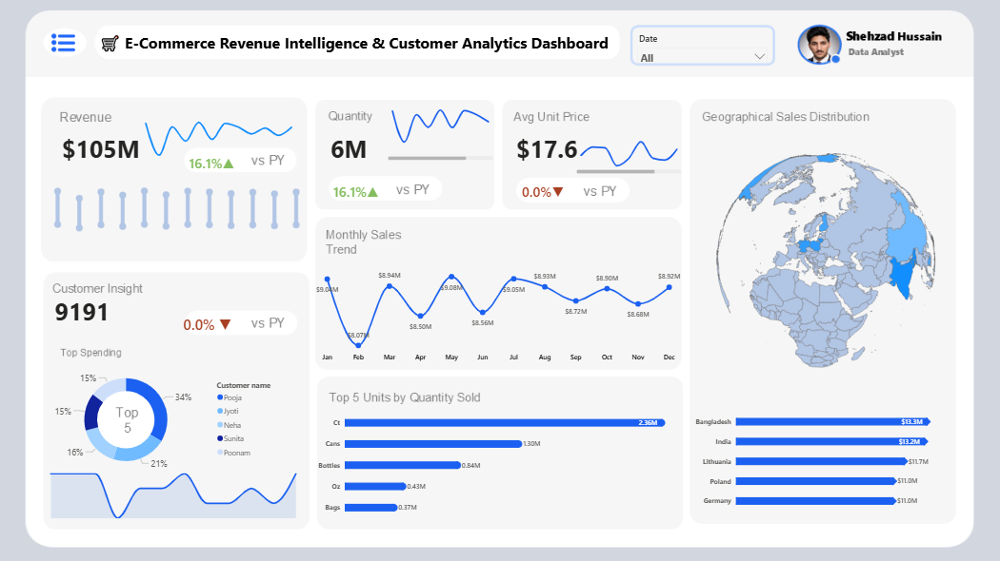
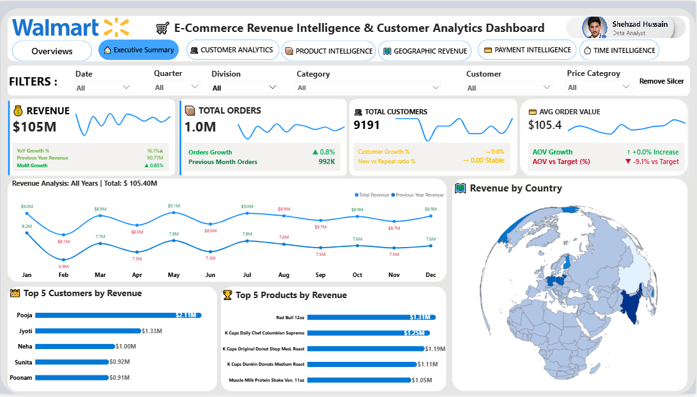
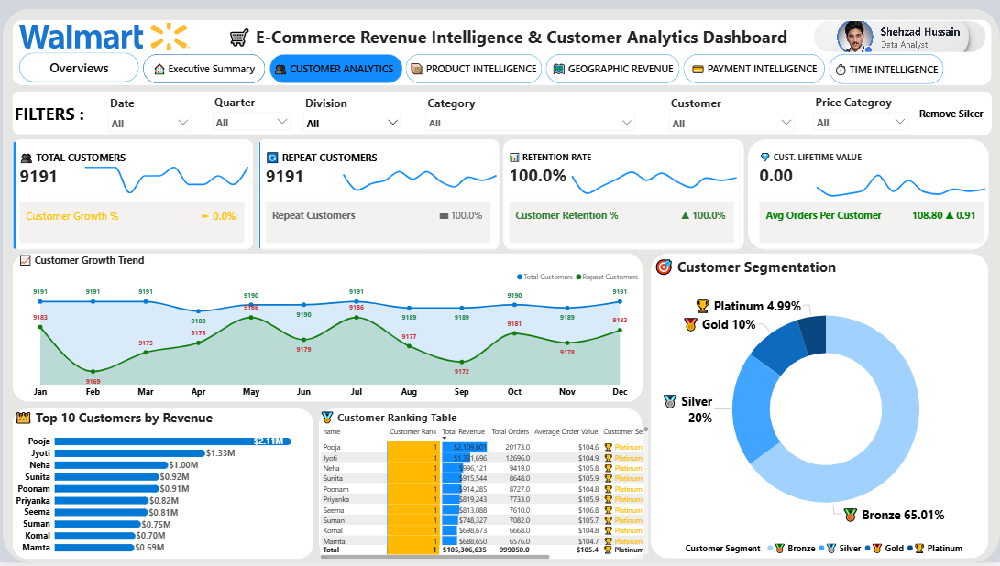
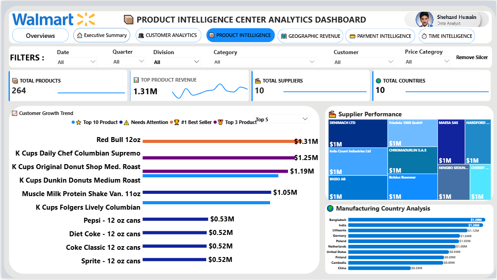
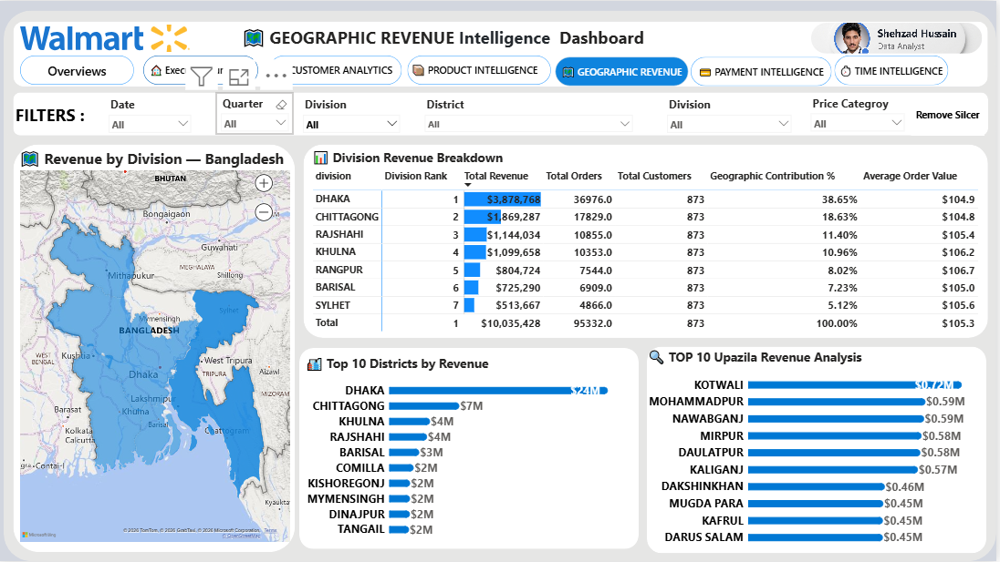
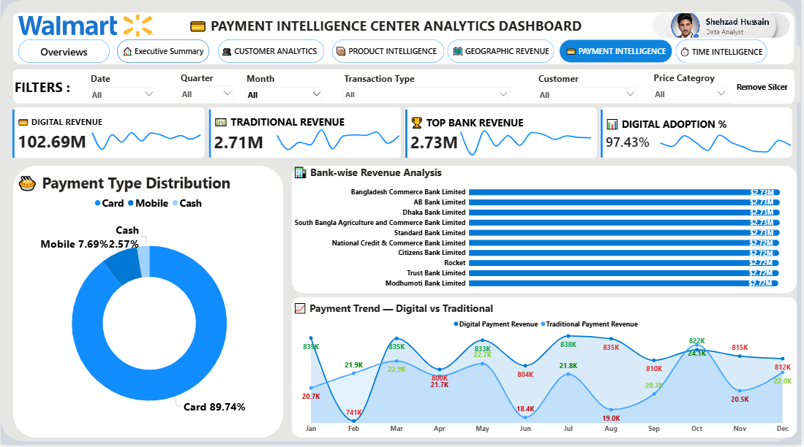
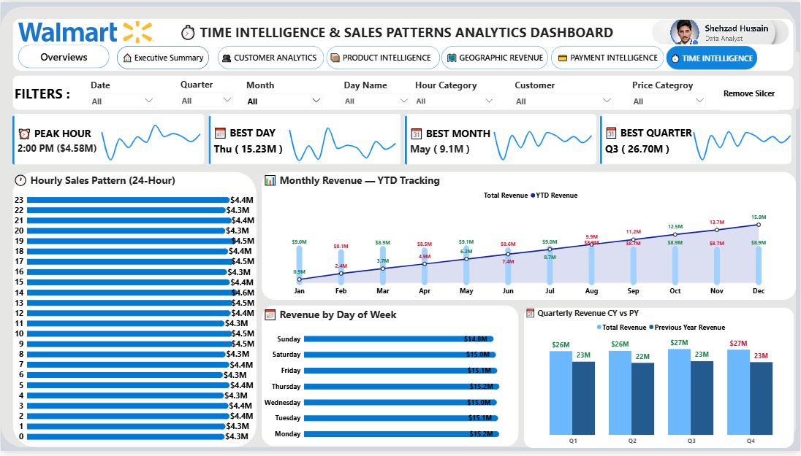

<!-- BANNER IMAGE - Click to open full size -->

 

<h1>🛒 Walmart E-Commerce Revenue Intelligence</h1>
<h3>& Customer Analytics Dashboard</h3>

  A fully interactive <strong>Power BI Dashboard</strong> delivering deep insights into 
  Walmart's e-commerce revenue, customer behavior, product performance, 
  geographic distribution, payment trends, and time-based sales patterns.

---

## 📌 Table of Contents

- [Project Overview](#-project-overview)
- [Key Metrics](#-key-metrics)
- [Dashboard Pages](#-dashboard-pages)
- [Screenshots](#-screenshots)
- [Tools & Technologies](#️-tools--technologies)
- [Repository Structure](#-repository-structure)
- [How to Use](#-how-to-use)
- [Key Insights](#-key-insights)
- [License](#-license)

---

## 📌 Project Overview

This **Power BI** project delivers a comprehensive **E-Commerce Revenue Intelligence 
& Customer Analytics Dashboard** built on Walmart's retail dataset. It features 
**7 fully interactive report pages** designed to support data-driven decisions 
across revenue, customer engagement, product strategy, and geographic expansion.

> 💡 **Goal:** Transform raw e-commerce transaction data into actionable business 
> intelligence through interactive visual storytelling.

---

## 🔑 Key Metrics

| Metric | Value | Trend |
|--------|-------|-------|
| 💰 Total Revenue | **$105M** | ↑ 16.1% YoY |
| 📦 Total Orders | **1.0M** | ↑ 0.8% Growth |
| 👥 Total Customers | **9,191** | Active Base |
| 💳 Avg Order Value | **$105.4** | Per Transaction |
| 🌍 Top Country | **Bangladesh** | $13.3M Revenue |
| 🏆 Top Customer | **Pooja** | $2.11M Lifetime Value |
| 🥇 Top Product | **Red Bull 12oz** | $1.31M Revenue |
| 💻 Digital Revenue | **$102.69M** | 97.43% Adoption |
| ⏰ Peak Sales Hour | **2:00 PM** | Highest Traffic |
| 📅 Best Quarter | **Q3** | $26.70M Revenue |

---

## 📊 Dashboard Pages

### Page 1 — 🏠 Overview
> High-level snapshot of total performance across all KPIs

| Metric | Value |
|--------|-------|
| Total Revenue | $105M |
| Total Quantity Sold | 6M Units |
| Average Unit Price | $17.6 |

---

### Page 2 — 📋 Executive Summary
> Strategic business summary for C-level stakeholders

| Metric | Value |
|--------|-------|
| YoY Revenue Growth | 16.1% |
| Total Orders | 1M+ |
| Total Customers | 9,191 |
| Average Order Value | $105.4 |

---

### Page 3 — 👥 Customer Analytics
> Behavioral segmentation and retention intelligence

| Metric | Value |
|--------|-------|
| Customer Retention Rate | 100% |
| Segments | Bronze / Silver / Gold / Platinum |
| Top Customer (LTV) | Pooja — $2.11M |

---

### Page 4 — 📦 Product Intelligence
> SKU-level performance and supplier analysis

| Metric | Value |
|--------|-------|
| Total Products | 264 SKUs |
| Total Suppliers | 10 |
| Top Product | Red Bull 12oz — $1.31M |

---

### Page 5 — 🗺️ Geographic Revenue
> Regional and district-level revenue mapping

| Metric | Value |
|--------|-------|
| Top Country | Bangladesh — $13.3M |
| Coverage | Division → District → Upazila |

---

### Page 6 — 💳 Payment Intelligence
> Payment method trends and digital adoption rates

| Metric | Value |
|--------|-------|
| Digital Payment Rate | 97.43% |
| Card Payment Share | 89.74% |
| Cash Transactions | 2.57% |

---

### Page 7 — ⏱️ Time Intelligence
> Hourly, daily, and quarterly sales trend analysis

| Metric | Value |
|--------|-------|
| Peak Sales Hour | 2:00 PM |
| Best Day | Thursday |
| Best Quarter | Q3 — $26.70M |

---

## 📸 Screenshots

### 🏠 Page 1 — Overview

---

### 📋 Page 2 — Executive Summary

---

### 👥 Page 3 — Customer Analytics

---

### 📦 Page 4 — Product Intelligence

---

### 🗺️ Page 5 — Geographic Intelligence

---

### 💳 Page 6 — Payment Intelligence

---

### ⏱️ Page 7 — Time Intelligence

---

## 🛠️ Tools & Technologies

| Tool | Purpose |
|------|---------|
|  **Power BI Desktop** | Dashboard Design & Visualization |
|  **DAX** | Data Analysis Expressions & KPI Measures |
| **Power Query (M)** | Data Cleaning & Transformation |
| **Microsoft Bing Maps** | Geographic Revenue Mapping |
| **Excel / CSV** | Raw Data Source |

---

## 📁 Repository Structure

<!-- ✅ This format is CORRECT -->

## 👤 Author

**Shehzad Hussain**
Data Analyst

